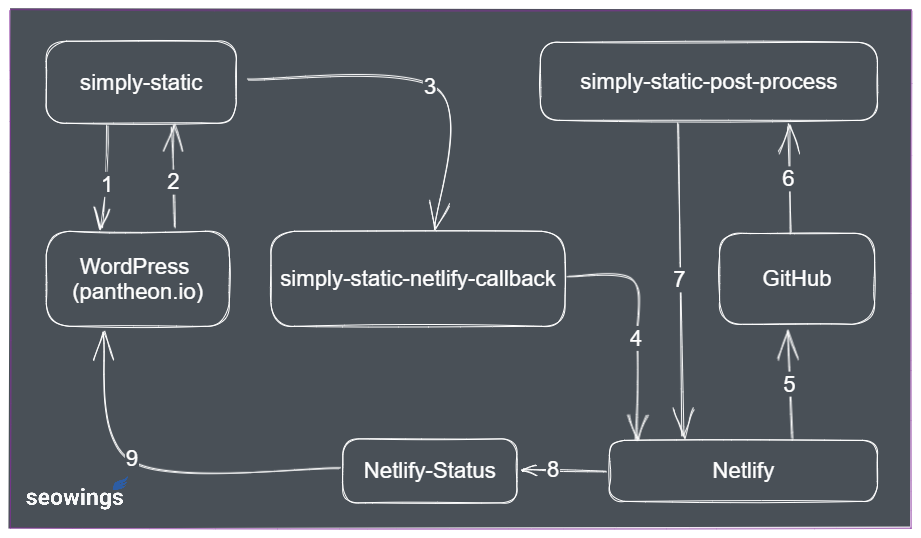

# Simply Static Post Process

A Python Library to prepare and deploy a static version of a WordPress Installation on Netlify (Static Hosting Service Provider). 

## How to Use simply-static-post-process?
Please check our detailed tutorial (video/text) on <a href="https://www.seowings.org/simply-static-tutorial/" target="_blank">Simply Static Post Process Tutorial</a> to understand how it works. This package has a live documentation file on <a href="https://simply-static.netlify.app" target="_blank">documentation link</a>.

## Contributions

Contributions, suggestions, and comments are welcome. Please fork the repository and submit a pull request.

## About Us

This work is a collaborative effort of <a href="https://seowings.org/" target="_blank">seowings</a> and <a href="https://serpwings.com/" target="_blank">serpwings</a>.

## LICENSE

- Simply Static Netlify Process is released under [MIT License](https://github.com/serpwings/simply-static-post-process/blob/master/LICENSE). 
- ``src\search.js`` is distributed without any additional licensing restrictions. Please consult ``src\search.js`` for more details.
